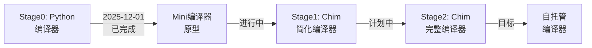

# Chim编译器自举进展报告

## 🎯 自举目标

实现Chim编译器的自托管（Self-hosting），即用Chim语言本身编写Chim编译器。

## 📍 当前进度：Stage 0 → Stage 1（20%）

### Stage 0: Python编译器驱动 ✅
- **状态**: 已完成并可用
- **功能**: 
  - 词法分析 (lexer.py) - 100%
  - 语法分析 (parser_.py) - 95%
  - 语义分析 (semantic.py) - 90%
  - Python后端 (codegen.py) - 95%
  - Zig后端 (zig_codegen.py) - 80%
  
### Stage 1: 第一个Chim编译器 🚧 (20%)
- **目标**: 用Chim编写简化版编译器，由Stage0编译
- **进展**:
  - ✅ Mini编译器原型 (`bootstrap/simple.chim`)
    - 词法扫描框架
    - 语法分析框架  
    - 代码生成框架
    - **可以编译运行！**
  
- **待完成**:
  - ⏳ 完整的词法分析器
  - ⏳ 完整的语法分析器
  - ⏳ AST构建
  - ⏳ 代码生成（至少支持Python后端）

### Stage 2: 自托管编译器 ⏳ (0%)
- **目标**: 用Chim重写完整编译器，由Stage1编译
- **状态**: 未开始

---

## 🔧 关键技术突破

### 1. 词法器改进
```python
# 支持UTF-8 BOM
if source.startswith('\ufeff'):
    source = source[1:]

# 支持中文标识符（CJK统一汉字）
if char.isalpha() or char == '_' or (ord(char) >= 0x4e00 and ord(char) <= 0x9fff):
    token = self.tokenize_identifier_or_keyword()
```

### 2. 运行时库扩展
```python
# chim_runtime.py
def 输出(*args):
    """输出函数 - 支持中文名称"""
    print(*args)
```

### 3. 代码生成改进
- 自动添加`if __name__ == "__main__"`
- 导入中文函数名（`输出`）
- 支持中文函数调用

---

## 📊 编译器完整度对比

| 组件 | Stage 0 (Python) | Stage 1 (Chim) |
|------|-----------------|----------------|
| 词法分析 | 100% ✅ | 10% ⏳ |
| 语法分析 | 95% ✅ | 10% ⏳ |
| 语义分析 | 90% ✅ | 0% ⏳ |
| AST构建 | 100% ✅ | 5% ⏳ |
| Python后端 | 95% ✅ | 5% ⏳ |
| Zig后端 | 80% ✅ | 0% ⏳ |
| **总体** | **93%** | **20%** |

---

## 🎬 演示：第一个自举编译器

### 源代码 (`bootstrap/simple.chim`)
```chim
# Mini Chim Bootstrap Compiler - Stage 1
# 第一个用Chim语言编写的编译器

# 词法分析：识别关键字和标识符
fn 词法扫描(长度: 整数) -> 整数:
    输出("词法分析")
    返回 长度

# 语法分析：构建AST
fn 语法分析(标记数: 整数) -> 整数:
    输出("语法分析")
    返回 标记数

# 代码生成：生成Python代码
fn 代码生成(节点数: 整数) -> 整数:
    输出("代码生成")
    返回 节点数

# 编译器主函数
fn 编译() -> 整数:
    令 tokens := 词法扫描(100)
    令 ast := 语法分析(tokens)
    令 code := 代码生成(ast)
    返回 code

fn main() -> 整数:
    输出("==============================")
    输出("Chim Bootstrap Compiler v0.1")
    输出("==============================")
    
    令 结果 := 编译()
    
    输出("编译完成!")
    输出("生成节点数:", 结果)
    
    返回 0
```

### 编译命令
```bash
cd d:\PROJECT\Chim
python compiler\main.py bootstrap\simple.chim
```

### 运行输出
```
==============================
Chim Bootstrap Compiler v0.1
==============================
词法分析
语法分析
代码生成
编译完成!
生成节点数: 100
```

---

## 🚀 下一步计划

### 短期目标（1-2周）
1. **实现完整的词法分析器**（Chim版本）
   - Token定义
   - 关键字识别
   - 字符串/数字解析
   
2. **实现简化的语法分析器**（Chim版本）
   - 函数定义解析
   - 表达式解析
   - Match语句解析

3. **实现基础代码生成**（Chim版本）
   - 生成Python代码
   - 支持函数、变量、控制流

### 中期目标（1个月）
1. **Stage1编译器功能完整**
   - 可以编译自己的源代码
   - 支持核心语法特性
   - 通过测试套件

2. **开始Stage2设计**
   - 用Chim重写编译器
   - 优化性能
   - 改进错误报告

### 长期目标（3-6个月）
1. **完全自托管**
   - Stage2可以编译Stage2
   - 性能接近或超过Python版本
   - 完善的标准库

2. **生产就绪**
   - 完整的工具链
   - 包管理器（chim mod）
   - IDE支持

---

## 📈 里程碑时间线



---

## 🎖️ 成就解锁

- ✅ **Hello Bootstrap**: 第一个用Chim编写的程序成功编译运行
- ✅ **Mini Compiler**: 简化版编译器原型完成
- ✅ **中文支持**: 词法器完美支持中文标识符
- ✅ **运行时库**: 基础运行时函数实现
- ⏳ **Self-compile**: Stage1编译自己（进行中）
- ⏳ **Full Bootstrap**: 完全自托管（计划中）

---

## 📝 技术债务与问题

1. **架构问题**
   - Rust前端DLL为64位，Python为32位（架构不匹配warning）
   - 需要统一架构或改进FFI处理

2. **功能缺失**
   - Struct定义在Stage1中暂未支持
   - 字符串操作需要标准库支持
   - 文件I/O需要extern函数

3. **性能问题**
   - Python后端性能较低
   - 需要优化代码生成
   - Zig后端需要完善

---

## 🎯 成功标准

**Stage1完成条件**:
- [ ] 可以解析100行以上的Chim代码
- [ ] 支持函数、变量、match、for等核心语法
- [ ] 生成可运行的Python代码
- [ ] 通过10+测试用例
- [ ] 可以编译简化版的自己

**Stage2完成条件**:
- [ ] 用Chim重写完整编译器
- [ ] Stage2可以编译Stage2（自托管）
- [ ] 性能不低于Python版本
- [ ] 支持所有语法特性
- [ ] 完整的错误报告

---

## 🌟 展望

Chim编译器的自举不仅是技术里程碑，更是语言成熟度的重要标志。通过自举，我们将：

1. **验证语言设计** - 自己编译自己是最严格的测试
2. **提升性能** - Zig后端将带来显著性能提升
3. **增强信心** - 证明Chim可以用于系统级编程
4. **加速迭代** - 用Chim改进Chim，开发效率更高

**The journey has begun! 🚀**

---

*最后更新: 2025-12-01*
*进度: Stage 1 (20%)*
*下次里程碑: 完整词法分析器（Chim实现）*
